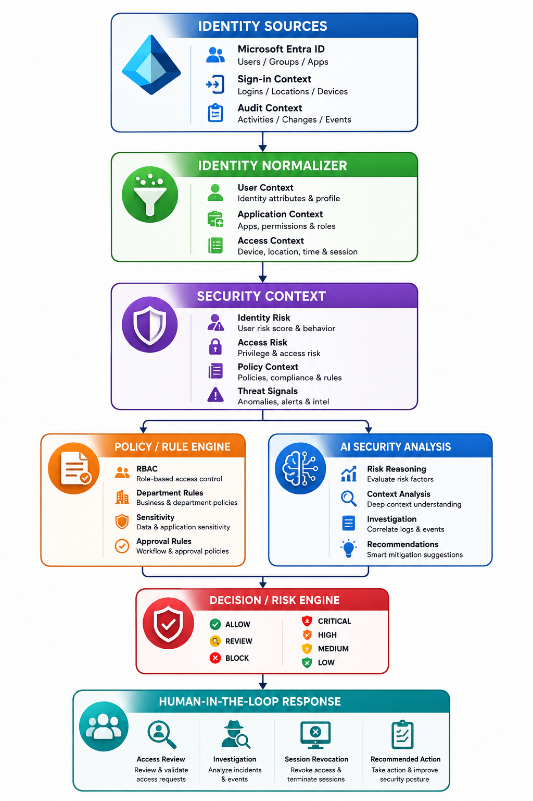
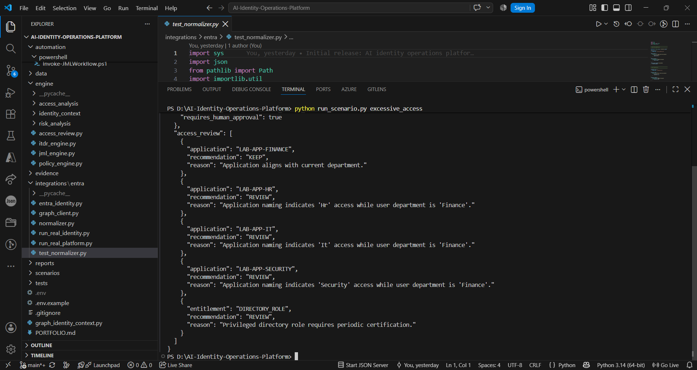
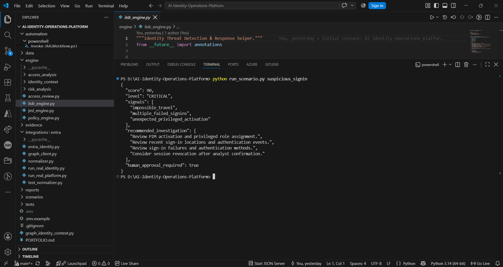
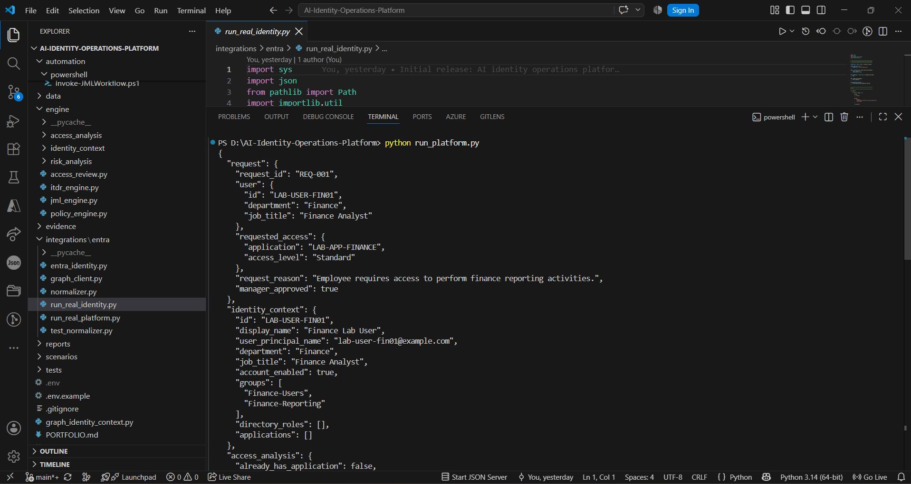
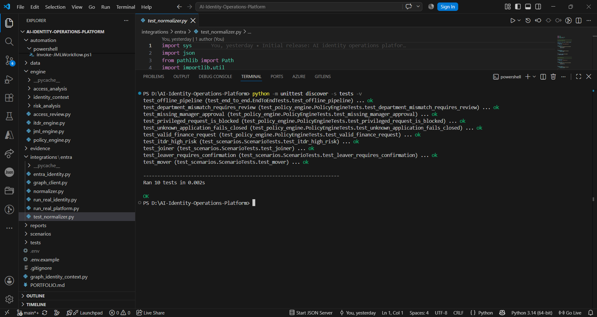

# AI Identity Operations Platform

An AI-assisted Identity Security Operations Platform designed to analyze identity activity, detect security risks, correlate identity-related events, and provide explainable security analysis.

The project demonstrates how identity security operations can combine deterministic detection, event correlation, risk analysis, and AI-assisted investigation into a structured security workflow.

---

## Architecture



The platform follows a modular identity-security pipeline:

```text
Identity / Security Events
            |
            v
      Event Processing
            |
            v
     Detection Engine
            |
            v
    Correlation Engine
            |
            v
      Risk Analysis
            |
            v
   AI-Assisted Analysis
            |
            v
   Security Findings
            |
            v
 Investigation / Response
```

The architecture separates event detection, correlation, analysis, and response so that security decisions remain explainable and controllable.

---

# Core Capabilities

## Identity Security Detection

The platform analyzes identity-related events and identifies security-relevant conditions.

Examples include:

- Suspicious identity activity
- Risky authentication behavior
- Excessive or abnormal access
- Identity-related security anomalies
- Multiple related security events
- High-risk identity activity

---

## Event Correlation

Individual identity events may not always indicate a security problem by themselves.

The correlation layer connects related events and evaluates them together.

```text
Event 1
  |
Event 2
  |
Event 3
  |
  v
Correlation Engine
  |
  v
Combined Identity Risk
```

This allows the platform to identify patterns that would be difficult to detect by examining isolated events.

### Correlation Evidence



---

# Detection Engine

The detection engine evaluates normalized identity/security events against defined detection logic.

The output contains structured security findings rather than raw events.

```text
Input Event
     |
     v
Detection Rules
     |
     v
Security Signal
     |
     v
Finding
```

The detection layer is deterministic and designed to provide explainable results.

### Detection Evidence



---

# Risk and Security Analysis

Detected events are evaluated to determine their security significance.

The platform can produce structured findings containing information such as:

- Finding type
- Identity involved
- Risk level
- Security reason
- Supporting event information
- Recommended investigation direction

The goal is to transform raw identity activity into an analyst-friendly security result.

---

# AI-Assisted Security Operations

The AI layer is designed to assist security analysis rather than blindly perform identity changes.

```text
Identity Events
      |
      v
Detection
      |
      v
Correlation
      |
      v
Risk Context
      |
      v
AI-Assisted Analysis
      |
      v
Security Recommendation
```

AI can assist with:

- Understanding security findings
- Summarizing identity activity
- Explaining why an event is risky
- Supporting investigation
- Recommending next investigation steps

The underlying detection and correlation logic remains deterministic.

---

# Security Design Principle

The platform separates:

```text
Detection
    !=
Analysis
    !=
Authorization
    !=
Execution
```

AI is therefore treated as an **assistance and analysis layer**, not as an unrestricted identity-authority mechanism.

This is important because identity-security decisions should remain explainable, auditable, and subject to appropriate controls.

---

# Platform Execution

Run the complete platform with:

```powershell
python run_platform.py
```

The execution demonstrates the complete processing pipeline from input events through detection, correlation, analysis, and final security output.

### Execution Evidence



---

# Correlation Flow

The correlation engine connects related identity-security signals before producing the final security assessment.

```text
Raw Events
    |
    v
Normalized Events
    |
    v
Identity Context
    |
    v
Related Events
    |
    v
Correlation
    |
    v
Security Finding
```

### Correlation Execution


---

# Detection Results

The detection engine produces structured results from the processed identity events.

```text
Input
  |
  v
Detection Rules
  |
  v
Matched Condition
  |
  v
Finding
  |
  v
Risk Context
```

### Detection Result


---

# Testing

The project includes automated tests for validating the implemented platform components.

Run:

```powershell
python -m unittest discover -s tests -v
```

The test suite validates the core detection, correlation, and platform behavior.

### Test Results



---

# Evidence

The repository contains execution evidence for the major platform components.

```text
evidence/
│
├── correlation.png
├── detection-result.png
├── execution.png
└── test-results.png
```

These screenshots demonstrate:

| Evidence | Purpose |
|---|---|
| `execution.png` | Complete platform execution |
| `detection-result.png` | Detection engine output |
| `correlation.png` | Correlation engine output |
| `test-results.png` | Automated validation |

---

# Project Structure

```text
AI-Identity-Operations-Platform/
│
├── architecture/
│   └── architecture.png
│
├── evidence/
│   ├── correlation.png
│   ├── detection-result.png
│   ├── execution.png
│   └── test-results.png
│
├── data/
│
├── engine/
│
├── scenarios/
│
├── tests/
│
├── run_platform.py
├── requirements.txt
└── README.md
```

---

# Running the Project

## Install Dependencies

```powershell
pip install -r requirements.txt
```

## Run the Platform

```powershell
python run_platform.py
```

## Run Tests

```powershell
python -m unittest discover -s tests -v
```

---

# Security Approach

The platform follows a controlled security-analysis model.

```text
Identity Activity
       |
       v
Detection
       |
       v
Correlation
       |
       v
Risk Context
       |
       v
AI-Assisted Analysis
       |
       v
Security Finding
       |
       v
Human Investigation
```

The system is designed to support security analysts rather than replace security governance controls.

---

# Technology

| Area | Technology |
|---|---|
| Language | Python |
| Domain | Identity Security |
| Identity Operations | IAM / Identity Security |
| Detection | Deterministic Detection Engine |
| Correlation | Identity Event Correlation |
| AI | AI-Assisted Security Analysis |
| Testing | Python `unittest` |
| Documentation | Markdown |
| Version Control | Git / GitHub |

---

# Security Considerations

This project is intended for laboratory, learning, and portfolio purposes.

Do not commit:

```text
Passwords
API Keys
Access Tokens
Client Secrets
Private Keys
Certificates
Production Credentials
Real Employee Data
Confidential Company Information
```

Synthetic or laboratory data should be used for demonstrations.

The platform is designed to generate security findings and analysis. Identity-changing actions should remain protected by appropriate authorization and human approval controls.

---

# What This Project Demonstrates

This project demonstrates practical understanding of:

- Identity Security
- IAM operations
- Security event processing
- Identity event detection
- Event correlation
- Risk analysis
- Security findings
- AI-assisted investigation
- Explainable security analysis
- Human-in-the-loop security
- Python security engineering
- Automated testing

---

# Interview Explanation

> I built an AI-assisted Identity Operations Platform that processes identity-security events, applies deterministic detection logic, correlates related events, and generates explainable security findings. The AI layer is used to assist investigation and analysis rather than directly making unrestricted identity decisions. The platform is structured into separate detection, correlation, risk-analysis, and AI-assisted investigation layers, with automated tests validating the implementation.

---

# Key Security Principle

```text
Raw Identity Events
        |
        v
Detection
        |
        v
Correlation
        |
        v
Risk Analysis
        |
        v
AI-Assisted Investigation
        |
        v
Explainable Security Finding
        |
        v
Human-Controlled Response
```

The primary objective is to transform raw identity activity into **correlated, explainable, and actionable identity-security intelligence**.